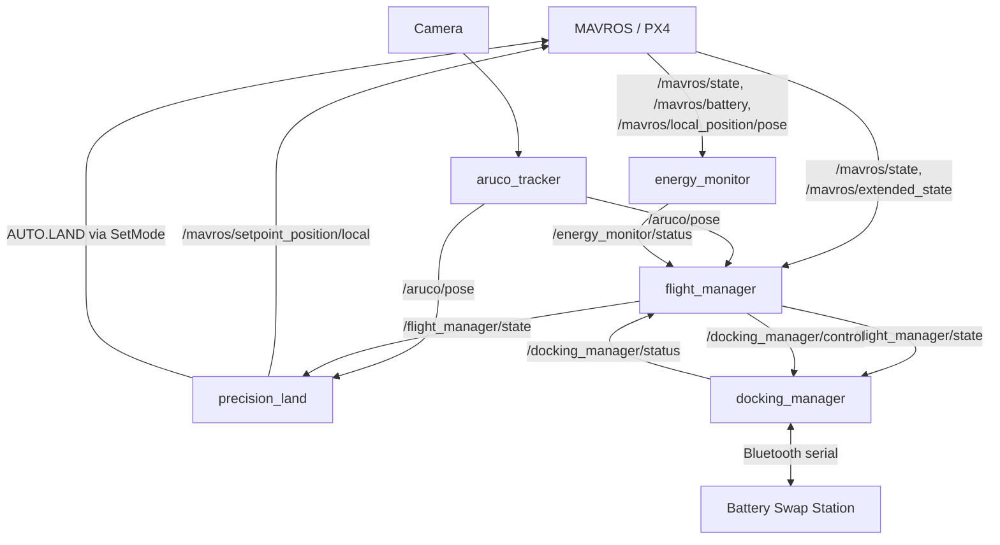

# Autonomous Precision Landing & Energy-Aware Flight Control for Drone Battery Swapping

This repository contains the flight-software layer I built for **E-gret**, an autonomous
drone battery-swap station developed as a graduation capstone project. E-gret lets a
multirotor return home mid-mission, land itself precisely on a fiducial marker, and dock
with a ground station that swaps its battery — no human in the loop.

E-gret was a team project. My scope was the **ROS 2 / PX4 flight-software pipeline**:
the state machine that sequences the mission, the energy model that decides *when* to come
home, the vision pipeline that finds the landing pad, and the control logic that lands and
docks the drone. The physical battery-swap mechanism's controller and the crop/target
detection AI model (`ai_detection/`) were built by other team members and are included here
only for context on how the full system fits together.

## Architecture

Five ROS 2 nodes, all in the `drone_system` package, run on a Raspberry Pi onboard the
drone alongside MAVROS (the PX4 bridge):



`flight_manager` is the coordinator: every other node reports status to it, and it alone
decides which phase of the mission is active. Nothing else in the pipeline makes a
top-level decision — they react to the state `flight_manager` publishes.

## Mission Sequence

```
IDLE → ARMED → MISSION_IN_PROGRESS → RETURNING_TO_BASE
     → PRECISION_LANDING → DOCKING → COMPLETED
```

1. **IDLE → ARMED → MISSION_IN_PROGRESS** — tracked directly from MAVROS `State`/`ExtendedState`.
2. **MISSION_IN_PROGRESS → RETURNING_TO_BASE** — triggered when `energy_monitor` publishes
   `RTL_REQUEST`; `flight_manager` commands PX4 into `AUTO.RTL`.
3. **RETURNING_TO_BASE → PRECISION_LANDING** — triggered once `aruco_tracker` has published
   a pose within the last 0.5 s; PX4 is switched to `OFFBOARD` so `precision_land`'s
   setpoints take effect.
4. **PRECISION_LANDING → DOCKING** — triggered once MAVROS reports landed and disarmed;
   `flight_manager` signals `docking_manager` to begin.
5. **DOCKING → COMPLETED** — triggered once `docking_manager` confirms a successful dock.

## Nodes

### `flight_manager.py`
The mission FSM described above, running at 2 Hz. It owns no hardware directly — it only
reads MAVROS state and node status topics, and writes PX4 mode changes via the
`/mavros/set_mode` service. Centralizing the FSM here means every other node can be simple
and reactive rather than tracking mission phase itself.

### `energy_monitor.py`
Decides whether the drone still has enough energy to get home, using a
**Control Barrier Function (CBF)** rather than a fixed low-battery threshold:

- Estimates energy required to return home from a `BatteryState`/pose stream:
  travel energy from an averaged power draw (rolling buffer of the last 10 samples) plus
  climb energy if altitude needs to be regained.
- Adds a safety margin (40% of estimated energy + a fixed 5 Wh pad) and a hard reserve
  (`critical_ratio = 0.22` of the 58 Wh pack).
- Defines a barrier `h` = remaining energy − needed energy − margin − reserve, and evaluates
  `ḣ + γh` (`γ = 0.5`) each tick. This penalizes energy *dropping too fast*, not just
  dropping too low — the RTL trigger fires on a trend, not a single low reading.
- Requires **2 consecutive violations** before firing `RTL_REQUEST`, filtering out
  single-sample noise from voltage/current sensing.

### `aruco_tracker.py`
Detects a 175 mm ArUco marker (`DICT_6X6_250`) on the landing pad using a calibrated camera
model (`solvePnP` with `SOLVEPNP_IPPE_SQUARE`), and republishes the last known pose at a
guaranteed 20 Hz regardless of detection rate — precision_land depends on a continuous
setpoint stream to keep PX4 in `OFFBOARD` mode, so a gap here would kick the drone out of
offboard control mid-landing.

### `precision_land.py`
Consumes ArUco poses only while `flight_manager` is in `PRECISION_LANDING`, applies a
correction factor (`2.0 / 1.47`, calibrated against measured landing error) to the marker's
Z estimate, and streams the corrected pose to `/mavros/setpoint_position/local` at 20 Hz.
Once altitude drops below the 0.7 m land threshold, it calls `AUTO.LAND` once (latched via
`landing_triggered`) rather than repeatedly re-triggering.

### `docking_manager.py`
Runs on the ground after landing: waits for an explicit `DOCKING` command from
`flight_manager` *and* confirmation the drone is landed and disarmed before doing anything,
then drives a servo (via GPIO PWM) to open the docking connector and negotiates the swap
over a Bluetooth serial link (`/dev/rfcomm0`) with a simple `DOCK_REQUEST` → `CONFIRMED`
handshake against the station. Publishes `DOCKED` back to `flight_manager` on success, or
`DOCKING_FAILED` if the Bluetooth link or the station doesn't confirm.

## Topic Reference

| Topic | Type | Publisher | Subscriber(s) |
|---|---|---|---|
| `/mavros/state`, `/mavros/extended_state` | MAVROS | PX4 | flight_manager, energy_monitor, docking_manager |
| `/mavros/battery`, `/mavros/local_position/pose`, `/mavros/home_position/home` | MAVROS | PX4 | energy_monitor |
| `/energy_monitor/status` | `String` | energy_monitor | flight_manager |
| `/aruco/pose` | `PoseStamped` | aruco_tracker | flight_manager, precision_land |
| `/aruco/detected` | `Bool` | aruco_tracker | — |
| `/flight_manager/state` | `String` | flight_manager | precision_land, docking_manager |
| `/docking_manager/control` | `String` | flight_manager | docking_manager |
| `/docking_manager/status` | `String` | docking_manager | flight_manager |
| `/mavros/setpoint_position/local` | `PoseStamped` | precision_land | PX4 |

## Build & Launch

Requires ROS 2, MAVROS, and PX4 SITL or a real flight controller connected via MAVLink.

```bash
cd ~/your_ros2_ws
colcon build --packages-select drone_system
source install/setup.bash
ros2 launch drone_system egret.launch.py
```

The launch file also brings up a `v4l2_camera` node feeding `aruco_tracker`. Camera
calibration is expected at `~/picam_v2_calib.yaml` (path is a launch parameter).

## Note on `state_machine.py`

This repository includes an earlier FSM prototype (`state_machine.py`) built around a
priority-ordered state model (`IDLE → MISSION → HOLD_HOME → PRECISION_LANDING → DOCKING →
DOCKED`) with its own topic set. It predates the current design and is **not part of the
active pipeline** — `egret.launch.py` does not launch it, and none of the live nodes publish
to the topics it listens on. It's kept here for history; the FSM actually flying is the one
inside `flight_manager.py`.

## Context: the Rest of E-gret

This flight-software layer is one piece of E-gret. The `ai_detection` package (a TFLite
crop/target model) and the physical battery-swap station hardware and its controller were
built by teammates and aren't documented in depth here.
